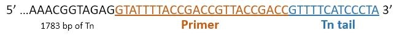
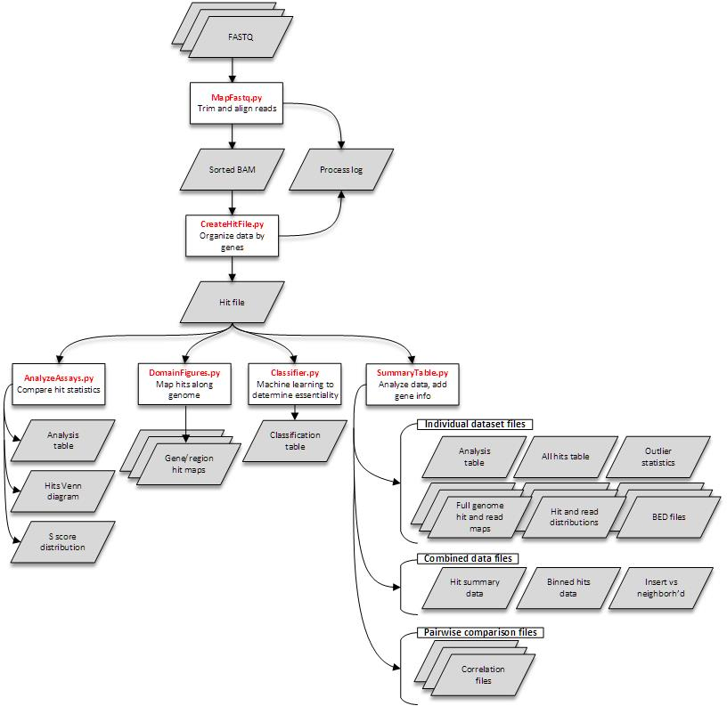

=====================
 Transposon-pipeline
=====================
------------
 User Guide
------------

:Author: Naama Dror

.. contents::

1 Introduction
==============

1.1 Purpose
-----------
Explanation needed.



1.2 Requirements
----------------
POSIX system running Python 2.7, Bowtie2 and Samtools.

Required Python packages (dependencies) from outside the standard library can be installed via bioconda (a bioinformatics conda channel) or the Python Package Index (pip).

1.2.1 Dependencies
``````````````````
* Bio
* cairocffi
* cPickle
* gffutils
* matplotlib
* matplotlib-venn
* numpy
* pandas
* pysam
* scipy
* sklearn


1.3 Workflow
------------



2 MapFastq.py
=============
2.1 Purpose
-----------
Takes concatenated FASTQ sequencing file for transposon experiments, removes the transposon and primer sequence (plus adaptor if set to), aligns sequence, and converts to a sorted BAM file. Program is written for use with the Berman lab transposon and primer, and for forward sequencing using the Illumina universal adapter. 


2.2 Default mode
----------------
Default settings require the input filename, assumes adapters are already removed, and will output to the current directory. 

.. note:: Make sure you know whether or not adapters are present before running this program. Adapters can be identified using FastQC or other FASTQ file analysis programs.

Program is run from the terminal as follows::

    python MapFastq.py -i filename.fastq.gz

The program will output log information to the terminal giving the number of reads found in the FASTQ file, and the number (and percentage) of reads which contained the transposon with it’s sequence. Three files will be created in the output directory:

:filename.sorted.bam: Sorted BAM file.
:filename.sorted.bam.bai: Index file for sorted BAM. 
:filename_log.txt: Log of reads before and after sequence removals and alignment. 


2.3 Optional arguments
----------------------
-o  Output directory. Defaults to current if left unspecified.
-a  Clean Illumina Universal adapters.
-d  Delete input FASTQ file.
-k  Keeps the cleaned FASTQ files.
-p  Check primer specificity if percent transposon in reads is low.


2.4 Glossary
------------
:Adapter:  3' Universal Illumina Adapter. It's sequence is: ``AGATCGGAAGAGCACACGTCTGAACTCCAGTCAC``
:Cleaned FASTQ:  Temporarily created FASTQ file with transposon, primer and (optionally) adapter removed from reads. Can be saved with optional argument.
:Primer:  24 bp forward primer placed 14 bp from the 3' end of the transposon. In default mode, it is used with the transposon tail to identify and remove the transposon from the 5' end of sequenced reads. It's sequence is: ``GTATTTTACCGACCGTTACCGACC`` and is unique in the genome. In cases where the percent of reads with these two sequences is found to be particularly low (<75%), an optional argument allows for the program to search reads for the primer alone. A high (>90%) primer/read ratio in this case indicates a problem of primer specificity.
:Transposon: 1796 bp Dc/As transposon used in the experiments for which this pipeline was created. Has a 24 bp PCR primer added near the 3' end.
:Transposon tail: 13 bp portion of the transposon found on the 3' end after the primer. It's sequence is: ``GTTTTCATCCCTA`` and is *not* unique in the genome. This is used in combination with the primer to identify and remove the transposon form the 5' end of sequenced reads. Should be found in >75% of the reads.


3 CreateHitFile.py
==================
3.1 Purpose
-----------
Goes through aligned BAM file(s), and outputs data in terms of hits and reads per gene in the *C. albicans* genome. This output is used as the source for all terminal outputs of the pipeline.


3.2 Default mode
----------------
.. note:: This can be run on an entire directory of sorted BAM files at once. Outputs will be separate for each BAM.

Default settings will locate and use sorted BAM file(s) in the current directory and output hit file(s) into the same directory. The default minimum map quality threshold is 20 hits, and merge distance is 2 nt. Program is run from the terminal as follows::

    python CreateHitFile.py

The program will output log information to the terminal giving the number of reads found in the FASTQ file, and the number (and percentage) of reads which contained the transposon with it’s sequence, and will add this information to the previous log file. Two files will be output per BAM file into the output directory:

:filename_hits.txt: Hit file for each input BAM. 
:filename_log.txt: Log of hits found. Appends to MapFastq's log for file if it exists.


3.3 Optional arguments
----------------------
-i  Input directory. Defaults to current if left unspecified.
-o  Output directory. Defaults to current if left unspecified.
-q  Set minimum map quality threshold. Default is 20 hits.
-k  Set maximum merge distance. Default is 2 nt.


3.4 Glossary
------------
:Map quality: Number of hits needed to parse from the BAM for a hit to be counted in a particular location.
:Merge distance: Distance between which two hits will be counted as a single hit located at their midpoint.


4 SummaryTable.py
=================
4.1 Purpose
-----------
Takes hit files and outputs a wide variety of images and analysis files for the data.

4.2 Default mode
----------------
.. note:: This can be run on an entire directory of sorted BAM files at once. Outputs will be separate for each BAM. If running on multiple files, consider using the "-c" argument for pairwise correlations.

Default settings locate hit file(s) in the current directory and output all results to the same. Default read depth is 1. Program is run from the terminal as follows::

    python SummaryTable.py

The program will output files specific to each hit file, and files which combine data from all hit files in the input directory. Specific files are prefixed with the name of their hit file source. Combined files have no filename prefix.

.. note:: N in all filenames is the read depth filter setting.

4.2.1 Individual files
``````````````````````
Each of these starts with "filename".

:_analysis.csv: Analysis file with table for each *C. albicans* gene. Gives information detailed below.
:.all_hits.csv: Explanation needed
:.filter_N.bed: Explanation needed
:.hit_map.png: Image showing the hits' locations along the *C. albicans* genome.
:.read_map.png: Image showing log10 of the reads' locations along the *C. albicans* genome.
:.neighborhood_index.N.500_300.png: Explanation needed
:.proteome.filter_N.bed: Explanation needed
:.read_map.png: Image showing the reads' locations along the *C. albicans* genome.
:.reads_distribution.hits.log10.rdf_N.png: Image showing log10 of the hits' distribution per feature.
:.reads_distribution.log10.rdf_N.png: Image showing log10 of the reads' distribution per feature.
:.outlier_stats.txt: Explanation needed

4.2.2 Combination files
````````````````````````
:binned_hits.RDF_N.csv: Explanation needed
:hit_summary.RDF_N.csv: Explanation needed
:insertion_vs_neighborhood_correlations.txt: Explanation


4.3 Optional arguments
----------------------
-i  Input directory. Defaults to current if left unspecified.
-o  Output directory. Defaults to current if left unspecified.
-f  Read depth filter. Default is 1.
-p  Perform pairwise correlations. Requires multiple hit files in input directory.

4.3.1 Correlation files
````````````````````````
These files are created when the "-c" argument is used. Each starts with "correlations"

:.pearson.hits_linear.csv:  Explanation?
:.pearson.hits_log.csv:  Explanation?
:.pearson.ni_linear.csv:  Explanation?
:.pearson.ni_log.csv:  Explanation?
:.pearson.reads_linear.csv:  Explanation?
:.pearson.reads_log.csv:  Explanation?
:.spearman.hits_linear.csv:  Explanation?
:.spearman.hits_log.csv:  Explanation?
:.spearman.ni_linear.csv:  Explanation?
:.spearman.ni_log.csv:  Explanation?
:.spearman.reads_linear.csv:  Explanation?
:.spearman.reads_log.csv:  Explanation?


4.4 Glossary
------------
:100 bp upstream: Explanation needed
:Common name: Explanation needed
:Description: Explanation needed
:Essential in Sc: Explanation needed
:Essential in Sp: Explanation needed
:Essential in albicans: Explanation needed
:Freedom index: Explanation needed
:Hits: Number of times the transposon was found in the exon(s) of a gene.
:Kornmann FI: Explanation needed
:Length: Explanation needed
:Logit FI: Explanation needed
:Max free region: Explanation needed
:Neighborhood: Explanation needed
:Read depth filter: Number of reads below which insertion events will be ignored.
:Reads: Number of reads in the FASTQ that covered a gene.
:Sc fitness: Explanation needed
:Sc ortholog: Explanation needed
:Sc synthetic lethals: Explanation needed
:Sp ortholog: Explanation needed
:Standard name: Explanation needed
:Type: Explanation needed


5 DomainFigures.py
==================
5.1 Purpose
-----------
Explanation needed

5.2 Positional arguments
------------------------
Used to choose a mode with which to define the drawn area. Argument and sub-arguments are written after the non-positional arguments (which equivalent to the optional arguments for other programs in this pipeline).

5.2.1 Region
````````````
Used to define the drawn area via chromosomal coordinates. Program is run from the terminal as follows::

    python DomainFigures.py region --chromosome X --start n --stop m


Requires all three of the following sub-arguments:

    --chromosome  Which chromosome to draw. For Calb choose: number '1' through '7' or 'R'.
    --start  bp position from which to start drawing figure.
    --stop  bp position from which to stop drawing figure.


Optional sub-argument:

    --genes  Choose gene(s) to highlight. Use standard name(s).

5.2.2 Gene
``````````
Used to define the drawn area via gene name(s). Program is run from the terminal as follows::

    python DomainFigures.py gene --genes NAME --percent-of-length

or::

    python DomainFigures.py gene --genes NAME --bps

Required sub-argument:

    --genes  Choose which gene(s) to draw and highlight. Use standard name(s).


Plus one of the following to define flanking region:

    --percent-of-length  Percent of gene's length. Default is 20% (input as 0.2) if argument is chosen but left unspecified.
    --bps  Basepairs before and after gene(s). Default is 20000 if argument is chosen but left unspecified.

5.2.3 Configuration file
````````````````````````
Explanation needed


5.3 Non-positional arguments
----------------------------
These arguments are all optional. If used they are added prior to the positional argument. 
Example::

    python DomainFigures.py --absolute-pixel-size 10 region --chromosome X --start n --stop m


--hits-dir  Input folder for hit file(s). Defaults to current if left unspecified.
--output-dir  Output folder for image(s). Defaults to current if left unspecified.
--domains   Which genes to draw essential domains onto. Choose between: all, highlighted, none. (Default is 'highlighted'.)
--direction  Which genes to draw read direction for. Choose between: all, highlighted, none. (Default is 'highlighted'.)
--organism  Choose between: Calb, Scer, Spom. (Default is 'Calb'.)
--absolute-pixel-size  Draws the figure length relative to the length of the region being drawn. This is useful when you want multiple images where genes in the images are comparable in size. (Default is off with all figures 250 px long.)


5.4 Glossary
------------
:Calb: *Candida albicans*. The reference genome used is SC3514 assembly 22, haploid A.
:Scer: *Saccharomyces cerevisiae*.
:Spom: *Schizosaccharomyces pombe*.
:Flanking region:  Explanation
:Highlight:  Explanation
:Standard name: Explanation


6 AnalyzeAssays.py
==================
6.1 Purpose
-----------
Explanation needed

6.2 Default mode
----------------
Explanation needed

6.3 Optional arguments
----------------------
-out    Output directory. Defaults to current directory if left unspecified.
-d      Draw histogram of S score distribution.
-v      Draw Venn diagram of *C. albicans* genes with hits.

6.4 Glossary
------------
:S score:  Explanation


7 Classifier.py
===============
7.1 Purpose
-----------
Get from Vladimir

7.2 Default mode
----------------
Get from Vladimir

7.3 Optional arguments
----------------------
Get from Vladimir

7.4 Glossary
------------
Get from Vladimir
